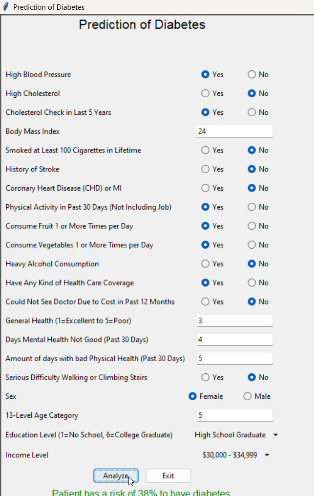

Diabetes is a critical public health issue in the United States, affecting millions of individuals annually and resulting in severe health complications and a significant economic burden. Diabetes occurs when the body either fails to produce sufficient insulin or cannot utilize it effectively. This leads to elevated blood sugar levels, which, if unmanaged, may result in complications such as: Heart disease, Vision impairment, Kidney damage and Amputations of lower limb

Our team has developed multiple machine learning approaches to tackle this major problem.

Mock-Up of our UI:

